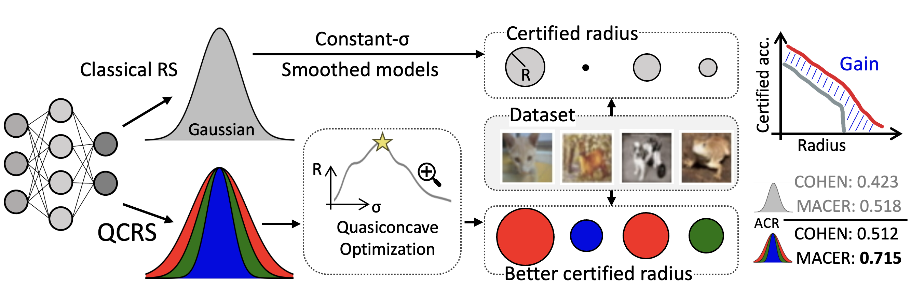

# Towards Large Certified Radius in Randomized Smoothing using Quasiconcave Optimization
## AISLAB @ NTU, AAAI 2024
## Abstract
Randomized smoothing is currently the state-of-the-art method that provides certified robustness for deep neural networks. However, due to its excessively conservative nature, this method of incomplete verification often cannot achieve an adequate certified radius on real-world datasets. One way to obtain a larger certified radius is to use an input-specific algorithm instead of using a fixed Gaussian filter for all data points. Several methods based on this idea have been proposed, but they either suffer from high computational costs or gain marginal improvement in certified radius. In this work, we show that by exploiting the quasiconvex problem structure, we can find the optimal certified radii for most data points with slight computational overhead. This observation leads to an efficient and effective input-specific randomized smoothing algorithm. We conduct extensive experiments and empirical analysis on CIFAR-10 and ImageNet. The results show that the proposed method significantly enhances the certified radii with low computational overhead.




# Environment
Clone the code:
```bash
git clone git@github.com:ntuaislab/QCRS.git
cd QCRS
```
Build python enviroment:
```bash
virtualenv env
source env/bin/activate
pip install torch torchvision torchaudio --index-url https://download.pytorch.org/whl/cu118
# pip install torch torchvision torchaudio
pip install -r requirements.txt
```
Download base classifier weights from [COHEN](https://github.com/locuslab/smoothing) or [MACER](https://github.com/MacerAuthors/macer).

# How to run
## CIFAR-10 experiment
```bash
# experiment with sigma=0.25
python code/certify_qcrs.py ./models/cifar10/resnet110/noise_0.25/checkpoint.pth.tar cifar_exp --sigma 0.25 --epsilon 0.03 --left 0.08 --right 0.9 --epsilon_step 0.4 --skip 1
# experiment with sigma=0.50
python code/certify_qcrs.py ./models/cifar10/resnet110/noise_0.50/checkpoint.pth.tar cifar_exp --sigma 0.50 --epsilon 0.03 --left 0.12 --right 1.7 --epsilon_step 0.2 --skip 1  

```
  - `./models/cifar10/resnet110/noise_0.50/checkpoint.pth.tar` is the path for model weights.
  - The results would be saved at `cifar_exp`
  - The augment `--skip` can be adjusted. If `--skip 1`, the full dataset will be evaluated. 
## ImageNet experiment
```bash
# experiment sigma=.25
python code/certify_qcrs.py ./models/imagenet/resnet50/noise_0.25/checkpoint.pth.tar imagenet_exp --dataset imagenet --skip 200 --sigma 0.25 --epsilon 0.01 --left 0.15 --right 0.40 --epsilon_step 0.8 --batch 1000
# experiment sigma=.50
python code/certify_qcrs.py ./models/cifar10/resnet110/noise_0.50/checkpoint.pth.tar imagenet_exp --dataset imagenet --skip 200 --sigma 0.50 --epsilon 0.01 --left 0.40 --right 0.60 --epsilon_step 0.4 --batch 1000
```

## MACER + QCRS
```bash
python code/certify_qcrs.py ./weights/0.50.pth macer_exp --sigma 0.50 --epsilon 0.03 --left 0.12 --right 1.9 --epsilon_step 0.2 --macer --skip 20
```

# To plot the result ACR curves:
```bash
python code/analyze.py
```
You need to assign the result files.


# Credits
   - Original randomized smoothing: [Certified Adversarial Robustness via Randomized Smoothing](https://github.com/locuslab/smoothing)
   - MACER: [MACER: Attack-free and Scalable Robust Training via Maximizing Certified Radius](https://github.com/MacerAuthors/macer)
   - DDRS: [Data Dependent Randomized Smoothing](https://github.com/MotasemAlfarra/Data_Dependent_Randomized_Smoothing)

# Citation
```
@inproceedings{kung2024qcrs,
  title={Towards Large Certified Radius in Randomized Smoothing using Quasiconcave Optimization},
  author={Kung, Bo-Han and Chen, Shang-Tse},
  booktitle={AAAI},
  year={2024}
}
```
